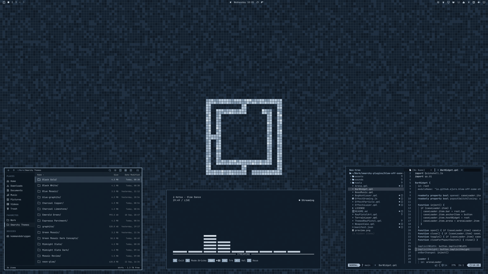
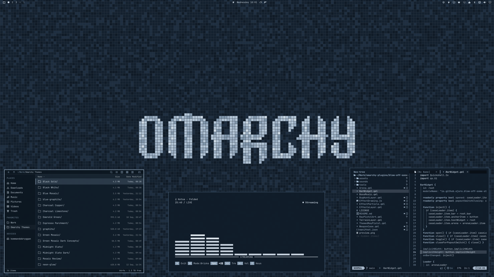

# Midnight Slate Dark Mosaic

Deep midnight-blue mosaic tiles, pale blue motifs, and cool blue interface accents. A dark theme for Omarchy.





## Install

For **Omarchy 4 with Omarchy Shell**:

```sh
omarchy theme install https://github.com/ejuro/omarchy-midnight-slate-dark-mosaic-theme
```

Use `omarchy theme bg next` to switch between the logo and wordmark wallpapers.

## The theme

- A continuous mosaic floor with two Omarchy motifs: logo and wordmark.
- A transparent top bar that blends into the tiled background.
- Solid dark windows, menus, notifications, and lock screen.
- Coordinated terminal and editor colors, GTK 3 / GTK 4 styling, and Adwaita icons.
- Application configs derive from `colors.toml` through Omarchy templates.

A darker variation of Midnight Slate, with the same pale blue motifs.

## Wallpapers

Two **3840 × 2160** wallpapers are included.

[Logo](backgrounds/01-midnight-slate-dark-mosaic-logo.png) · [Wordmark](backgrounds/02-midnight-slate-dark-mosaic-wordmark.png)

## License

[MIT](LICENSE) · [Omarchy artwork attribution](THIRD_PARTY_NOTICES.md)
